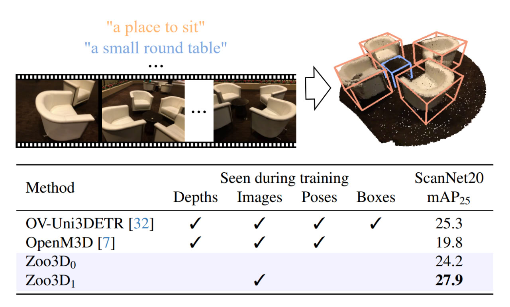

# 🦁 Zoo3D: Zero-Shot 3D Object Detection at Scene Level 🐼

## 🐾 News

⏳🐢 Code will be released soon! Stay tuned.

 
 

 

#### 🦊 Open-vocabulary 3D object detection aims to localize 3D bounding boxes given a textual description.

#### 🦓 We demonstrate that this task can be solved in a zero-shot mode (Zoo3D0).

#### 🐒 Our self-supervised image-based (w/o ground truth poses and depths) approach Zoo3D1 performs on par with point cloud-based methods trained with 3D bounding boxes supervision.

